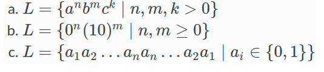
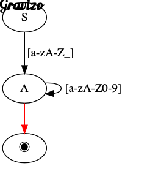
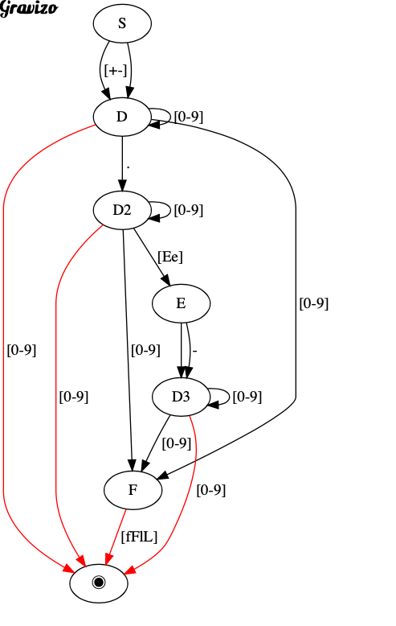

#
## Задание 1
Дана грамматика. Постройте вывод заданной цепочки.
#
- a.
    ```
     S : T | T '+' S | T '-' S;
     T : F | F '*' T;
     F : 'a' | 'b';
     ```
    Цепочка:  ```a - b * a + b```.


**S** →  (**T** - **S**) → (**T** - **T** + **S**) → (**T** - **T** + **T**) → (**T** - **T** + **F**) → (**T** - **T** + b) → (**T** - **F** * **T** + b) → (**T** - **F** * **F** + b) → (**T** - **F** * a + b) → (**T** - b * a + b) → (**F** - b * a + b) → (a - b * a + b) 

- b.
    ```
    S : 'a' S B C | 'ab' C;
    C B : B C;
    'b' B : 'bb';
    'b' C : 'bc' ;
    'c' C : 'cc';
    ```
    Цепочка: ```aaabbbccc```.


**S** → (a**SBC**) → (aa**SBCBC**) → (aaab**CBCBC**) → (aaab**BCCBC**) → (aaabb**CCBC**) → (aaabb**CBCC**) → (aaabb**BCCC**) → (aaabbb**CCC**) → (aaabbbc**CC**) → (aaabbbcc**C**) → (aaabbbccc)

#
Построить грамматику, порождающую язык:\

#
a.\
G ({a, b, c}, {S, A, B, C}, P, S)\
P:\
    S : 'a' A;\
    A -> 'a' A | B;\
    B -> 'b' B | C;\
    C -> 'c' | 'c' C;

b.\
G ({0, 10}, {S, A, B}, P, S)\
P:\
    S : '0' | '0' A | B | ε;\
    A : '0' A | B | ε;\
    B : '10' | '10' B;

c.\
G ({0, 1}, {S, A}, P, S)\
P:\
    S : '0' A '0' | '1' A '1';\
    A : '0' A '0' | '1' A '1' | ε;\
#

## Задание 3
К какому типу по Хомскому относится грамматика с приведенными правилами? Аргументируйте ответ.
#
a.
```
S : '0' A '1' | '01';
'0' A : '00' A '1';
A : '01';
```
Левая часть содержит и терминальные, и нетерминальные символы → либо тип 0, либо тип 1.  Правая часть длиннее левой части → тип 1. (КЗ - грамматика)

b.
```
S : A 'b';
A : A 'a' | 'ba';
```

Левая часть содержит только нетерминальные символы → либо тип 2, либо тип 3. Правая часть содержит один нетерминальный символ → тип 3. (регулярная грамматика).

#
## Задание 4
Построить КС-грамматику, эквивалентную грамматике с правилами:
```
S : A B | A B S;
A B : B A;
B A : A B;
A : 'a';
B : 'b';
```
#
S : 'ab' S | 'ba' S | 'a'S 'b'| 'b' S 'a' | 'ab' | 'ba';

#
## Задание 5
Построить регулярную грамматику, эквивалентную грамматике с правилами:
```
S : A '.' A;
A : B | B A;
B : '0' | '1';
```
#
S : '1' S | '0' S | '1' A | '0' A;\
A : '.' B;\
B : '1' B | '0' B | '0' | '1';
#

## Задание 6
Напишите регулярное выражение. В качестве ответа приведите:

1. Регулярные выражения

2. Тестовые данные для проверки

3. Ссылку на https://regexr.com/ с вашим решением
#
a. Для множества идентификаторов, где идентификатор – это последовательность букв или цифр, начинающаяся с буквы или _;
#
[Решение](https://regexr.com/790km)

#
b. Для множества вещественных констант с плавающей точкой, состоящих из целой части, десятичной точки, дробной части, символа е или Е, целого показателя степени с необязательным знаком и необязательного суффикса типа – одной из букв f, F, l или L. Целая и дробная части состоят из последовательностей цифр. Может отсутствовать либо целая, либо дробная часть (но не обе сразу).
#
[Решение](https://regexr.com/790m3)
#

#
## Задание 7
Для регулярных выражений из предыдущего задания постройте конечные автоматы. Изобразите их в виде графа. Для встраивания изображения в ответ воспользуйтесь сервисом http://gravizo.com/

S : '_' A | '[a-zA-Z]' A;\
A : '[a-zA-Z]' A | '[0-9]' A | eps;

```
  digraph G {
    S -> A [label="[a-zA-Z_]"];

    edge [color=black];
    A -> A [label="[a-zA-Z0-9]"];

    edge [color=red];
    A -> ◉;
  }
```
<!--  A [label="[a-zA-Z_]"];
    edge [color=black];
    A -> A [label="[a-zA-Z0-9]"];
    edge [color=red];
    A -> ◉;
  }
'> -->


#

#
S : '+' D | '-' D | D;\
D : [0-9] D | [0-9] | '.' D2 | [0-9] F ;\
D2 : [0-9] D2 | [0-9] | [0-9] F | 'e' E | 'E' E;\
E : '-' D3 | D3;\
D3 : [0-9] D3 | [0-9] | F;\
F : 'f' | 'F' | 'l' | 'L';

```
digraph G {
    S -> D [label="[+-]"];
    S -> D;

    D -> D [label="[0-9]"];
    edge [color=red];
    D -> ◉ [label="[0-9]"];
    edge [color=black];
    D -> F [label="[0-9]"];
    D -> D2 [label=" ."];

    D2 -> D2 [label="[0-9]"];
    edge [color=red];
    D2 -> ◉ [label="[0-9]"];
    edge [color=black];
    D2 -> F [label="[0-9]"];
    D2 -> E [label="[Ee]"];

    E -> D3 [label=" -"];
    E -> D3;

    D3 -> D3 [label="[0-9]"];
    edge [color=red];
    D3 -> ◉ [label="[0-9]"];
    edge [color=black];
    D3 -> F [label="[0-9]"];

    edge [color=red];
    F -> ◉ [label="[fFlL]"];
  }
```
<!--  D [label="[+-]"];
    S -> D;
    D -> D [label="[0-9]"];
    edge [color=red];
    D -> ◉ [label="[0-9]"];
    edge [color=black];
    D -> F [label="[0-9]"];
    D -> D2 [label=" ."];
    D2 -> D2 [label="[0-9]"];
    edge [color=red];
    D2 -> ◉ [label="[0-9]"];
    edge [color=black];
    D2 -> F [label="[0-9]"];
    D2 -> E [label="[Ee]"];
    E -> D3 [label=" -"];
    E -> D3;
    D3 -> D3 [label="[0-9]"];
    edge [color=red];
    D3 -> ◉ [label="[0-9]"];
    edge [color=black];
    D3 -> F [label="[0-9]"];
    edge [color=red];
    F -> ◉ [label="[fFlL]"];
  }
'> -->

